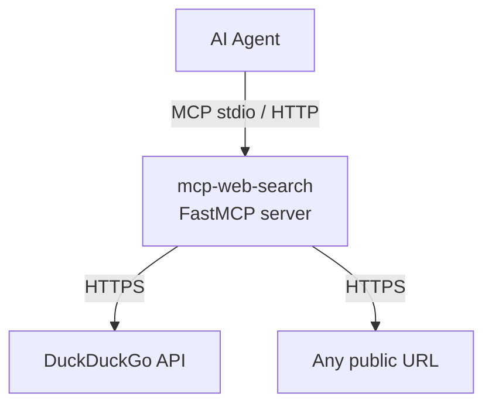

# mcp-web-search

> A local MCP server that gives Claude or IBM Bob or other Agents web search and page-fetching capabilities.
> Built to work around:
> - the network restrictions that Claude organisation accounts operate under.
> - no built-in "web search" capabilities.

## Why this exists

Claude.ai organisation accounts restrict outbound network access to a fixed domain allowlist. General web search and browsing are blocked and regular members cannot change that. Personal accounts have built-in web search and don't have this problem.

This server runs locally on your machine — where the internet is unrestricted — and proxies web requests back to Claude via the MCP protocol. If you've ever hit `host_not_allowed` with no way to fix it, this is for you.

IBM Bob does not have built-in web-browsing or internet capability due.

## What it does

Two tools, nothing more:

| Tool | Description |
|---|---|
| `search_list` | Search the web via DuckDuckGo and return up to 10 ranked results |
| `access_site` | Fetch any URL, follow redirects, and return its content as plain text |

## Tech stack

| Component | Technology | Version |
|---|---|---|
| Language | Python | ≥ 3.12 |
| MCP framework | FastMCP (`mcp` package) | ≥ 1.28.1 |
| Search backend | DuckDuckGo (`ddgs` package) | ≥ 9.14.4 |
| Package manager | uv | any recent |

## Architecture

AI agent calls one of the two tools over MCP. The server makes the outbound request from the local machine (bypassing Claude and/or IBM Bob's network restrictions) and returns structured JSON.

## Key design decisions

**No authentication on the server**
Decision: The server accepts all requests without any auth token or API key.
Why: It only binds to `127.0.0.1` by default and is intended as a personal local tool — adding auth would be friction with no real security benefit in that context.
Do not change because: adding auth here would also require changes to every Claude Desktop config that uses this server.

**Raw `urllib` instead of `httpx` / `requests`**
Decision: `access_site` uses the stdlib `urllib.request` only.
Why: Avoids an extra dependency for a single HTTP call. `ddgs` already handles the search transport.
Do not change because: it keeps the dependency surface minimal; only revisit if redirect handling or TLS behaviour becomes a problem.

## Setup & contributing

See [CONTRIBUTING.md](CONTRIBUTING.md).
